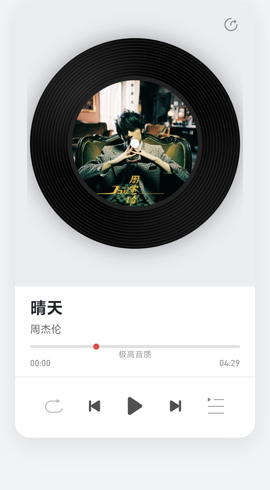
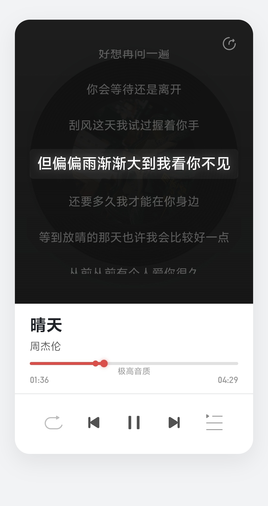

# 🎵 北海 · 网易云风格音乐播放器

> 一个精致的仿网易云音乐风格的在线音乐播放器，采用黑胶唱片拟真交互设计，支持歌词同步、播放列表管理、多种播放模式。

---

## 🖼️ 界面预览

### 首页 · 黑胶唱片播放器



精美黑胶唱片风格主界面，支持唱片旋转动画、滑动切歌、播放/暂停、模式切换等交互操作。

### 歌词同步显示



全屏歌词同步显示模式，支持点击跳转、高亮当前行、夜间沉浸式体验。

---

## 🎯 功能特性

### 🎵 核心播放功能

- **黑胶唱片播放器**：拟真黑胶唱片旋转动画，支持拖拽滑动切换歌曲
- **歌词同步显示**：自动解析 LRC 格式歌词文件，实时高亮当前演唱行
- **多种播放模式**：顺序播放、单曲循环、随机播放自由切换
- **播放进度控制**：点击进度条任意位置跳转，高潮时间点高亮标记
- **高品质音频**：支持极高音质音频流畅播放

### 🎨 视觉与交互设计

- **网易云风格 UI**：简洁优雅的界面设计，精心调校的色彩与动画
- **响应式布局**：完美适配 PC、平板、手机等各类设备
- **夜间歌词模式**：全屏沉浸式歌词显示，专注音乐体验
- **黑胶唱片拟真动画**：真实唱片旋转与滑动切换效果
- **流畅手势操作**：支持左右滑动切歌、点击歌词跳转

### 🔧 实用工具

- **歌曲分享**：支持 Web Share API 原生分享与链接复制
- **播放列表管理**：完整播放列表，支持历史播放记录回溯
- **智能缓存**：自动缓存歌词和歌曲数据，提升加载速度
- **歌曲管理后台**：可视化增删改歌曲信息，批量管理

---

## 📁 项目文件结构

```
NetEasemusic/
├── index.php                    # 播放器主页面
├── README.md                    # 项目说明文档（本文件）
├── LICENSE                      # MIT 开源许可证
│
├── assets/                      # 静态资源
│   ├── css/
│   │   └── style.css            # 页面样式表
│   ├── js/
│   │   └── app.js               # 主应用逻辑
│   ├── fonts/                   # 字体文件
│   │   ├── Gilroy-ExtraBold.otf
│   │   ├── Gilroy-Light.otf
│   │   ├── Rajdhani-Medium-apex.ttf
│   │   ├── street-regular.otf
│   │   ├── a.ttf
│   │   └── b.ttf
│   ├── images/                  # 图片资源
│   │   ├── appIcon.png
│   │   └── styli2.png
│   └── icons/                   # SVG 图标
│       ├── 播放.svg
│       ├── 暂停.svg
│       ├── 上一首.svg
│       ├── 下一首.svg
│       ├── 顺序.svg
│       ├── 单曲.svg
│       ├── 随机.svg
│       ├── 列表.svg
│       ├── 分享.svg
│       └── 设置.svg
│
├── music/                       # 音频文件（10 首周杰伦经典曲目）
│   ├── 晴天 - 周杰伦.mp3
│   ├── 花海 - 周杰伦.mp3
│   ├── 青花瓷 - 周杰伦.mp3
│   ├── 搁浅 - 周杰伦.mp3
│   ├── 告白气球 - 周杰伦.mp3
│   ├── 烟花易冷 - 周杰伦.mp3
│   ├── 蒲公英的约定 - 周杰伦.mp3
│   ├── 一路向北 - 周杰伦.mp3
│   ├── 我落泪情绪零碎 - 周杰伦.mp3
│   └── 我是如此相信 - 周杰伦.mp3
│
├── lrc/                         # LRC 歌词文件（与音频对应）
│   ├── 晴天.lrc
│   ├── 花海.lrc
│   ├── 青花瓷.lrc
│   ├── 搁浅.lrc
│   ├── 告白气球.lrc
│   ├── 烟花易冷.lrc
│   ├── 蒲公英的约定.lrc
│   ├── 一路向北.lrc
│   ├── 我落泪情绪零碎.lrc
│   └── 我是如此相信.lrc
│
├── data/
│   └── songs.json               # 歌曲元数据配置文件
│
├── admin/
│   └── songs.php                # 歌曲管理后台
│
├── screenshots/                 # 项目截图
│   ├── preview-portrait-1.jpg   # 首页主界面
│   └── preview-portrait-2.jpg   # 歌词显示模式
│
├── logs/                        # 运行日志
│   └── ip.txt                   # 访问记录
│
└── .gitignore                   # Git 忽略规则
```

---

## 🚀 快速开始

### 环境要求

- **Web 服务器**：Apache / Nginx（支持 PHP）
- **PHP 版本**：PHP 7.4 或更高
- **浏览器**：支持 ES6 的现代浏览器（Chrome / Firefox / Edge / Safari）
- **文件权限**：`data/songs.json` 需可读写（建议 664）

### 安装步骤

1. **部署文件**：将项目文件放置到 Web 服务器目录
2. **配置权限**：确保 `data/songs.json` 具有写入权限
3. **添加歌曲**：编辑 `data/songs.json` 或访问 `admin/songs.php` 可视化添加
4. **访问播放器**：浏览器打开 `index.php` 即可开始使用

### Nginx 特殊配置

如使用 Nginx，需确保以下 MIME 类型支持：

```nginx
types {
    audio/mpeg        mp3;
    text/plain        lrc;
    image/svg+xml     svg;
}
```

---

## 📱 使用说明

### 基本播放控制

| 操作 | 方式 |
|------|------|
| 播放 / 暂停 | 点击中间黑胶唱片或播放按钮 |
| 上一首 / 下一首 | 点击左右箭头按钮，或左右滑动唱片 |
| 切换播放模式 | 点击左上角模式切换按钮（顺序→单曲→随机） |
| 进度跳转 | 点击进度条任意位置 |
| 切换歌曲 | 从播放列表点击任意曲目 |

### 歌词功能

- **显示歌词**：点击唱片区域进入全屏歌词模式
- **歌词跳转**：点击任意歌词行跳转到对应时间点
- **回退唱片**：点击歌词区域空白处返回唱片视图

### 播放列表

- **打开列表**：点击右下角列表按钮
- **播放历史**：在列表中切换到"播放历史"标签页
- **关闭列表**：点击空白区域或关闭按钮

### 歌曲管理（后台）

- **添加歌曲**：访问 `admin/songs.php` 填写表单提交
- **编辑歌曲**：点击"编辑"修改歌曲信息
- **删除歌曲**：点击"删除"移除歌曲

---

## ⚙️ 数据格式

### songs.json 配置

```json
[
  {
    "id": 1,
    "title": "晴天",
    "artist": "周杰伦",
    "cover": "封面图片 URL",
    "audio": "music/晴天 - 周杰伦.mp3",
    "lrc": "lrc/晴天.lrc",
    "climax": "01:25",
    "duration": "04:29",
    "quality": "极高音质"
  }
]
```

### LRC 歌词格式

```lrc
[00:00.00]晴天 - 周杰伦
[00:10.00]故事的小黄花
[00:15.00]从出生那年就飘着
[01:25.00]🎵 高潮部分
```

---

## 🛠️ 技术栈

| 类别 | 技术 |
|------|------|
| **前端** | HTML5 / CSS3 / 原生 JavaScript（零依赖） |
| **后端** | PHP 数据处理 + JSON 轻量存储 |
| **图标** | SVG 矢量图标，清晰无缩放 |
| **布局** | 响应式设计，完美适配多端 |
| **音频** | Web Audio API |
| **分享** | Web Share API 原生分享 |
| **缓存** | LocalStorage 本地数据缓存 |

---

## 🐛 常见问题

**Q: 音频无法播放？**
A: 检查音频文件路径是否正确，确认浏览器支持 MP3 格式，查看控制台是否有跨域（CORS）错误。

**Q: 歌词不显示？**
A: 检查 LRC 文件路径和格式是否正确，确认文件编码为 UTF-8。

**Q: 管理后台无法保存？**
A: 检查 `data/songs.json` 的文件写入权限。

**Q: 移动端手势无效？**
A: 确认浏览器支持触屏事件，检查页面是否有缩放。

---

## 📄 开源协议

本项目基于 **MIT 许可证** 开源，详见 [LICENSE](LICENSE) 文件。

---

## 🌟 致谢

- 灵感来源于网易云音乐的优秀设计
- 感谢所有贡献者和用户的支持与反馈

---

> **最后更新**：2026 年 6 月  
> **版本**：v3.0
